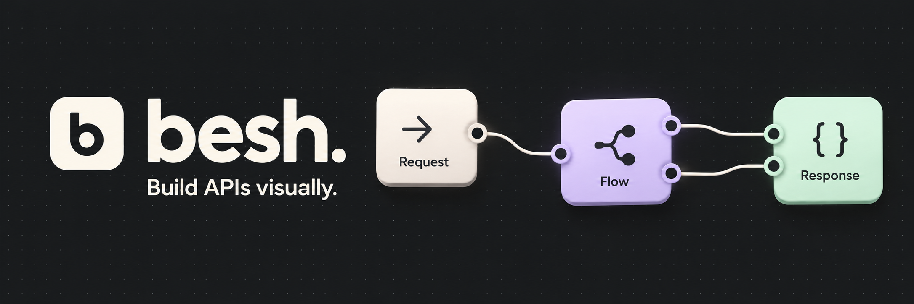

# Besh

Build and publish APIs visually. Connect nodes, test drafts, and publish REST, GraphQL, or WebSocket endpoints with scoped access and audit logs.

Besh is an early local development preview. Remote databases, more login providers, plugins, and the AI operator remain planned.

https://github.com/user-attachments/assets/15d58a79-3a1c-4dad-93f8-c1918cfddcd8

[Download Windows portable 0.19.0-alpha.0](https://github.com/mysbryce/besh/releases/download/v0.19.0-alpha.0/besh-0.19.0-alpha.0-windows-x64.exe), with no Bun installation required. See [ZIP and checksums](https://github.com/mysbryce/besh/releases/tag/v0.19.0-alpha.0) and [portable instructions](docs/portable.md).

## Start locally

Install [Bun](https://bun.sh/docs/installation) 1.4.2 or newer, then run:

```sh
bun install --frozen-lockfile
bun run setup
```

Open the setup link printed in the terminal. Name your workspace and save the owner key. No database server or manual environment edits are required. Keep the terminal running.

For later sessions:

```sh
bun run dev
```

Open `http://127.0.0.1:5173` and sign in with your workspace key or configured email/password. See [getting started](docs/getting-started.md) for configuration, examples, and recovery.

## What works

- Visual REST/GraphQL builder, searchable step categories, favorites, typed inputs and OpenAPI.
- [Typed WebSocket replies](docs/websockets.md), browser draft testing, and one-use tickets.
- [Generated backend routes](docs/runtime-code.md), saved drafts, release history, and rollback.
- [Client code examples](docs/client-code.md) in eight targets.
- Built-in k6 load testing with automatic setup and optional goals.
- [Roles and selected-API sharing](docs/roles.md), [scoped keys and handover](docs/api-keys.md), and [protected tenant rows and API fields](docs/row-protection.md).
- [Member invitations](docs/workspace-invitations.md) with one-use password setup links.
- [Visual content model drafts](docs/structs.md) with nested fields and versioned saving.
- [CSV, Excel, public Sheets](docs/data-sources.md), uploaded SQLite copies, and GitHub product-login templates.
- Audit logs, migrations, tested backups, and GitHub update notices.
- Light/dark themes, [seven languages in main workflows](docs/localization.md), custom controls and page/action previews.

## Documentation

[Documentation index](docs/README.md) · [Getting started](docs/getting-started.md) · [Load testing](docs/load-testing.md) · [API reference](docs/api.md) · [Roadmap](docs/roadmap.md)

[Contributing](docs/contributing.md) · [Security](SECURITY.md) · [AI policy](AI_POLICY.md)

MIT licensed. See [LICENSE](LICENSE) and [third-party notices](THIRD_PARTY_NOTICES.md).
